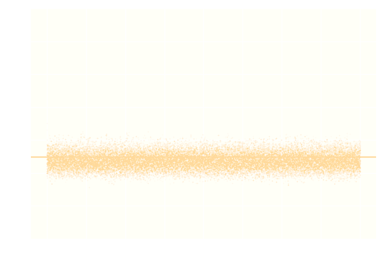

### A Few Announcements 

There is a survey: [https://www.surveymonkey.com/r/pycon232](https://www.surveymonkey.com/r/pycon232).

Morning Break will be at 10:15 a.m. in the lobby outside this room.

Lunch will be at 12:20 p.m. in the Oregon Ballroom 201-204 upstairs.

If you have requested a kosher meal, please let the server know.

There should be enough power outlets at the tables, please share them.


## Abstract

There has been uprising of probabilistic programming and Bayesian statistics. These techniques are tremendously useful, because they help us to understand, to explain, and to predict data through building a model that accounts for the data and is capable of synthesizing it. This is called the generative approach to statistical pattern recognition.

...


...

Estimating the parameters of Bayesian models has always been hard, impossibly hard actually in many cases for anyone but experts. However, recent advances in probabilistic programming have endowed us with tools to estimate models with a lot of parameters and for a lot of data. In this tutorial, we will discuss one of these tools, [Edward](http://edwardlib.org). Edward is a black box tool, a Swiss army knife for Bayesian modeling that does not require knowledge in calculus or numerical integration. This puts the power of Bayesian statistics into the hands of everyone, not only experts of the field. And, it's great that Edward is implemented in Python with its rich, beginner-friendly ecosystem. It means we can immediately start playing with it.


### Outline

#### Introduction

#### Coin Flip

#### A/B/... Testing

#### Bayesian Curve Fitting

#### Fitting Categorical Data

#### The Bayesian Netflix Problem


# Rational Decisions under Uncertainty


### Making Rational Decisions under Uncertainty

You can rarely be certain about the outcome of a decision.

<br/>

Decisions tend to be **impulsive**.

Decisions based solely on personal experience tend to be **risky**.

<br/>

=> We are **terrible decision makers**.

<br/>

**Probabilistic programming** can assist our decision making process. 

It helps us to **utilize data** for rational decision making.


### Probabilistic Programming (PP)

PP enables **rational decisions under uncertainty**.

PP is used to **encode initial beliefs** about how a particular set of data could have been generated.

PP yields insight by solving the **inference problem** -- update beliefs given new evidence.

PP gives the flexibility to **iterate** over modeling assumptions.

The PP system that is discussed in this tutorial is **Edward**.


### Edward

Edward is a PP framework developed at Columbia University. It supports **probabilistic reasoning at scale**.

Edward uses state-of-the-art techniques in computing coming from the deep learning community.

Edward provides an expressive **PP language** to declare parameterized models that can simulate the observed data, or data like it.

[//]: # (In Edward, **composition** is used to express complex situations.)

In Edward, **scalable inference algorithms** figure out which model parameters yield simulated data that are consistent with the observed data. This is what is needed for rational decision making.

[//]: # (Edward also provides abstractions to **develop entirely new algorithms** or to compose existing ones into **new ones**.)

<div style="font-size: 75%; margin-top: 2em;">
Dustin Tran, Alp Kucukelbir, Adji B. Dieng, Maja Rudolph, Dawen Liang, and David M. Blei. 2016. [Edward: A library for probabilistic modeling, inference, and criticism.](https://arxiv.org/abs/1610.09787) arXiv preprint arXiv:1610.09787.
</div>


# A Simple Example


### Coin Toss

You toss a coin 100 times and see 43 heads. Is it a fair coin?

```python
>>> c_train
array([0, 0, 1, 0, 1, 0, 1, 0, 0, 1, 1, 1, 0, 0, 0, 0, 1, 1, 1, 1, 0, 0, 0,
       1, 1, 0, 1, 1, 1, 0, 0, 0, 1, 0, 0, 0, 1, 1, 0, 0, 0, 1, 1, 0, 0, 1,
       0, 0, 0, 1, 1, 0, 0, 0, 1, 0, 1, 0, 1, 1, 0, 0, 1, 0, 0, 1, 1, 1, 0,
       0, 0, 0, 0, 0, 0, 1, 0, 0, 1, 0, 0, 0, 0, 0, 0, 1, 1, 1, 1, 1, 1, 0,
       1, 1, 0, 0, 1, 0, 0, 1], dtype=int32)
>>> sum(c_train == 0)
57
>>> sum(c_train == 1)
43
```


### What Can We Say About The Fairness of The Coin?

1. **Posit A Generative Model.** Start with a simple story about how the data is generated. How could things be arranged that we end up seeing coin tosses like the ones observed? -- **Forward direction**.

2. **Infer The Model Parameters.** Infer the specifics about that story based on the observations. Given the model and the data, how likely is it that the coin has a particular fairness? -- **Backward direction**.

3. **Criticize The Model.** Can the simple story explain the observations? Can we improve the story? (->1)

If we follow this process, we are operating in a **loop**.


# Model Building


### What Is Model Building?

Model building is the process of stating our beliefs about how the data could have been generated.

Models are simplified descriptions of the world. They are valid only in a certain regime.

Models can be declared as abstract mathematical descriptions or as code.

Models allow for the simulation of data. -- **Forward direction**.

<br/>

<blockquote>
Essentially, all models are wrong, but some are useful.
</blockquote>
<div style="width: 100%; font-size: 75%; text-align: right; margin-top: 1em; margin-bottom: 1em;">
  George E.P. Box
</div>


### A Generative Model for A Coin Toss

Our story expressed in terms of **probability distributions**:

$$ p(\text{params}, \text{data}) = p(\text{params}) \times p(\text{data} | \text{params}) $$

$\text{params}$: fairness of the coin.

$\text{data}$: coin tosses.

$p(\text{params})$: **prior probability** of a certain fairness.

$p(\text{data} | \text{params})$: **conditional probability** that the data is observed **given that** the coin has a certain fairness.

$p(\text{params}, \text{data})$: **joint probability** that **both** the data is observed **and** the coin has a certain fairness.


### A Generative Model for A Coin Toss

Our story in the **PP language** Edward:

```python
>>> pheads = Uniform(low=0.0, high=1.0)              # $\text{params}$: fairness of the coin.
>>> c = Bernoulli(probs=pheads, sample_shape=100)    # $\text{data}$: coin tosses.
```

`Uniform(low=0.0, high=1.0)`: **prior probability** of the fairness. `Uniform` stands for complete uncertainty with respect to the fairness.

`Bernoulli(probs=pheads, sample_shape=100)`: **conditional probability** that the data is observed **given** a certain `pheads`. `Bernoulli` models a toss of a coin with fairness `probs`.


### A Generative Model for A Coin Toss

```python
>>> pheads = Uniform(low=0.0, high=1.0)              # $\text{params}$: fairness of the coin.
>>> c = Bernoulli(probs=pheads, sample_shape=100)    # $\text{data}$: coin tosses.
```

This composition is a **generative model** of a randomized trial that we can **simulate**:

```
>>> sess.run([pheads, c])                            # sample coin fairness and coin tosses
[0.49367917, array([1, 1, 0, 1, 1, ...], dtype=int32)]
>>> (sum(_[1] == 0), sum(_[1] == 1))                 # count tails and heads
(48, 52)
```

`sess.run([pheads, c])`: **sample from the joint probability** of the coin fairness and the coin tosses.


# DEMO


### A Generative Model for A Coin Toss

We can now go **forwards**:

<div style="width: 100%; text-align: center; margin-top: 1em; margin-bottom: 1em;">
  `pheads`, `c` -simulation-> `0.49367917`, `(48, 52)`
</div>

The fairness `pheads` is a parameter that is usually unknown!

<br/>

What we actually want:

<div style="width: 100%; text-align: center; margin-top: 1em; margin-bottom: 1em;">
  `pheads` <-inference- `(48, 52)`
</div>

We want to look **backwards** and ask: What are the likely values of `pheads` given the observations?


# Inference


### What Is Inference?

Inference is updating your beliefs after considering new evidence.

Inference is identifying which parameters yield simulated data that is consistent with the observed data.

Inference allows for going in the **backward direction**.

<br/>

<blockquote>
I've got information man! New shit has come to light!
</blockquote>
<div style="width: 100%; font-size: 75%; text-align: right; margin-top: 1em; margin-bottom: 1em;">
  The Dude in The Big Lebowski, Gramercy Pictures (1998)
</div>


### Inference of The Fairness of A Coin

Inference expressed in terms of **probability distributions**:

<div style="width: 100%; text-align: center; margin-top: 1em; margin-bottom: 1em;">
   $p(\text{params} | \text{data} = \text{obs})$ <-conditioning- $p(\text{params}, \text{data})$, $\text{obs}$
</div>

This is the **backwards direction**.

$\text{obs}$: fixed **realization of the data**, that is, coin tosses.

$p(\text{params} | \text{data} = \text{obs})$: **posterior conditional distribution** of the coin fairness **given** a fixed observation of coin tosses. This is the object we are interested in.

Any statistical question we can ask has to come down to a manipulation of the posterior! It is the single most versatile object we can deal with, and it is composable.


### Bayes' Theorem

<div style="width: 100%; text-align: center; margin-top: 1em; margin-bottom: 1em;">
  $p(\text{params} | \text{data} = \text{obs}) = \displaystyle \frac{p(\text{params}) \times p(\text{data} = \text{obs} | \text{params})}{p(\text{data} = \text{obs})}$
</div>


### Inference of The Fairness of A Coin

Exact inference in the **PP language** Edward:

```python
>>> pheads_cond = ed.complete_conditional(pheads)       # derive the posterior $p(\text{params} | \text{data})$
>>> pheads_post = ed.copy(pheads_cond, {c: c_train})    # bind the posterior to the observations
>>> sess.run({key: val for
...           key, val in six.iteritems(pheads_post.parameters)
...           if isinstance(val, tf.Tensor)})
{'concentration0': 51.0, 'concentration1': 51.0}
```

This is possible only if the posterior can be derived by algebraic manipulation. The result will be **exact** given the model and the data.


# DEMO


### Inference of The Fairness of A Coin

Approximate inference in the **PP language** Edward:

```python
>>> # BACKWARD MODEL
>>> q_pheads = ??                                             # define posterior vars
>>> # INFERENCE
>>> inference = ed.Inference(latent_vars={pheads: q_pheads},  # bind latent to posterior vars
...                          data={c: c_train})               # bind random vars to data
```

Running inference:

```python
>>> inference.run()
```

Implementations of `Inference`: **Markov Chain Monte Carlo (MCMC)**, **Variational Inference**, ...


# Markov Chain Monte Carlo


### What is Markov Chain Monte Carlo (MCMC)?

MCMC is a class of **randomized** algorithms that **approximate** the posterior, $p(\text{params} | \text{data} = \text{obs})$.

A Markov chain is an **infinite stream** of parameter values generated by applying a **random function** repeatedly.


### What is Markov Chain Monte Carlo (MCMC)?

Given an arbitrary seed, an arbitrary Markov chain jumps around randomly in the space of all possible parameter values.

<div style="width: 100%; text-align: center; margin-top: 0em;">
  
</div>


### What is Markov Chain Monte Carlo (MCMC)?

In MCMC, the random function **focuses the chain** such that it spends more time at parameter values for which the posterior is large.

<div style="width: 100%; text-align: center; margin-top: 0em;">
  
</div>


### What is Markov Chain Monte Carlo (MCMC)?

In the **infinite** limit, the relative time spent at any parameter value is **equal** to the posterior at that parameter value.

<div style="width: 100%; text-align: center; margin-top: 0em;">
  
</div>


### What Is Markov Chain Monte Carlo (MCMC)?

For **finite** lengths, the chain may or may not be a good approximation.

<div style="width: 100%; text-align: center; margin-top: 0em;">
  
</div>


### MCMC: Metropolis Hastings

The random function has 2 steps: Proposal and admission/rejection.

<div style="font-size: 90%; margin-top: 1em;">
Proposals to a value with **higher** posterior are always accepted.
</div>

<div style="font-size: 90%; margin-top: 1em;">
Proposals to a value with **lower** posterior are accepted with a probability proportional to the ratio of proposed and current posterior.
</div>

```python
>>> T = 10000                                                  # length of the chain
>>> q_pheads = Empirical(params=tf.Variable(tf.ones([T])*.5))  # define posterior vars
>>> proposal_pheads = Beta(1.0, 1.0)                           # define proposal distribution
>>> inference = ed.MetropolisHastings(
...                 latent_vars={pheads: q_pheads},            # bind latent to posterior vars
...                 proposal_vars={pheads: proposal_pheads},   # bind latent vars to proposal
...                 data={c: c_train})                         # bind random vars to data
>>> inference.run()                                            # run inference
```


# DEMO


### MCMC: Gibbs Sampling

Gibbs sampling is a special case of Metropolis Hastings.

The proposal for a parameter is drawn from its **complete conditional**, that is, the distribution of that parameter conditioned on the current values of all other parameters. 

This proposal is **always accepted**.

```python
>>> T = 10000                                                  # length of the chain
>>> q_pheads = Empirical(params=tf.Variable(tf.ones([T])*.5))  # define posterior vars
>>> inference = ed.Gibbs(latent_vars={pheads: q_pheads},       # bind latent to posterior vars
...                      data={c: c_train})                    # bind random vars to data
>>> inference.run()                                            # run inference
```


# DEMO


### MCMC: Hamiltonian Monte Carlo (HMC)

Metropolis Hastings and Gibbs will fail in high-dimensional parameter spaces while HMC will not.

HMC utilizes the **geometry** of the important regions of the posterior (where the probability mass is concentrated) to guide the jump proposal.

```python
>>> T = 10000                                                  # length of the chain
>>> q_pheads = Empirical(params=tf.Variable(tf.ones([T])*.5))  # define posterior vars
>>> inference = ed.HMC(latent_vars={pheads: q_pheads},         # bind latent to posterior vars
...                    data={c: c_train})                      # bind random vars to data
>>> inference.run(step_size=1.0 / N, n_steps=20)               # run inference
```


# DEMO


# Variational Inference


### What Is Variational Inference (VI)?

VI is a class of algorithms that cast posterior inference as **optimization**:
<ol start="2">
	<li><span style="text-decoration: line-through">**Infer**</span> **Approximate The Model Parameters**, that is, the posterior $p(\text{params} | \text{data} = \text{obs})$:
		<ol style="list-style-type: lower-alpha;">
		  <li>
		  	**Build** a **variational backward model**, $q(\text{params}; \mathbf{\lambda})$, over the $\text{params}$ with some variational parameters $\mathbf{\lambda}$.
		  </li>
		  <li>
		  	**Match** $q(\text{params}; \mathbf{\lambda})$ to $p(\text{params} | \text{obs})$ by optimizing over $\mathbf{\lambda}$,
	      $$
	      	\begin{aligned}
	      		\mathbf{\lambda}^\* & = \, \mathrm{argmin}\_{\mathbf{\lambda}} \; \mathrm{Closeness}\left(p(\text{params} | \text{obs}), q(\text{params}; \mathbf{\lambda})\right).
	      	\end{aligned}
			  $$
		  </li>
		  <li>
		  	**Use** $q(\text{params}; {\mathbf{\lambda}^\*})$ instead of $p(\text{params} | \text{obs})$.
		  </li>
		  <li>
		  	**Criticize** the variational model, revise it (->a).
		  </li>
		</ol>
	</li>


### Variational Inference: KLqp

```python
>>> # BACKWARD MODEL
>>> q_pheads_concentration1 = tf.nn.softplus(tf.Variable(tf.random_normal([])))   # variational
>>> q_pheads_concentration0 = tf.nn.softplus(tf.Variable(tf.random_normal([])))   # parameters $\lambda$
>>> q_pheads = Beta(concentration1=q_pheads_concentration1,    # posit variational backwards 
...                 concentration0=q_pheads_concentration0)    # model $q(\text{params}; \mathbf{\lambda})$
```

Use the Kullback-Leibler divergence, `KLqp`, to measure closeness between $p(\text{params} | \text{obs})$ and $q(\text{params}; \mathbf{\lambda})$:

```python
>>> # INFERENCE
>>> inference = ed.KLqp(latent_vars={pheads: q_pheads},        # bind latent to posterior vars
...                     data={c: c_train})                     # bind random vars to data
>>> inference.run(n_samples=1, n_iter=1000)                    # run inference
```


# DEMO


# Criticism


### Inference Quality

Two main influences to inference quality:

1. **Do the priors and the likelihood reflect reality?**

2. **How much data do you have?** The more data, the less important the priors.


### Where Can I Read More About This?

Tran et al., **Edward: A library for probabilistic modeling, inference, and criticism**, [arXiv:1610.09787](https://arxiv.org/abs/1610.09787)

Tran et al., **Deep and Hierarchical Implicit Models**, [arXiv:1702.08896](https://arxiv.org/abs/1702.08896)

Tran et al., **Deep Probabilistic Programming**, [arXiv:1701.03757](https://arxiv.org/abs/1701.03757)

Blei et al., **Variational Inference: Foundations and Modern Methods**, [NIPS 2016 Tutorial](https://nips.cc/Conferences/2016/Schedule?showEvent=6199)

<br/>

### Where Can I Get Help?

[Edward Gitter channel](https://gitter.im/blei-lab/edward)

[Edward Community forum](https://discourse.edwardlib.org/)
